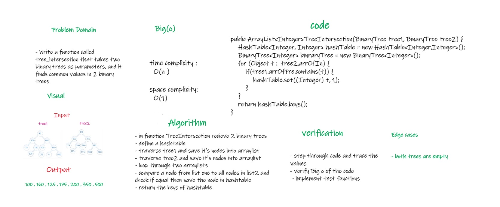

# Challenge Summary
<!-- Description of the challenge -->
* - Write a function called tree_intersection that takes two binary trees as parameters, and it finds common values in 2 binary trees

## Whiteboard Process
<!-- Embedded whiteboard image -->

## Approach & Efficiency
<!-- What approach did you take? Why? What is the Big O space/time for this approach? -->
- in function TreeIntersection recieve 2 binary trees
- define a hashtable
- traverse tree1 and save it's nodes into arraylist
- traverse tree2 and save it's nodes into arraylist
- loop through two arraylists
- compare a node from list one to all nodes in list2 and check if equal then save the node in hashtable
- return the keys of hashtable

* time complixity :
  O(n )

space complixity:
O(1)

## Solution
<!-- Show how to run your code, and examples of it in action -->
call the function treeIntersection and pass 2 binary trees in the parameters
ex : treeIntersection(tree1 , tree2)

[Link to code](app/src/main/java/TreeIntersection/TreeIntersection.java)