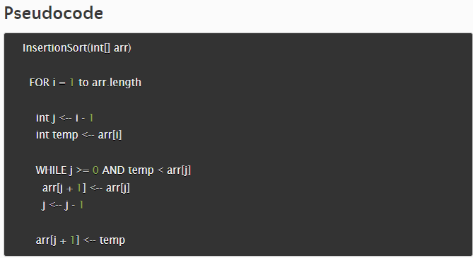
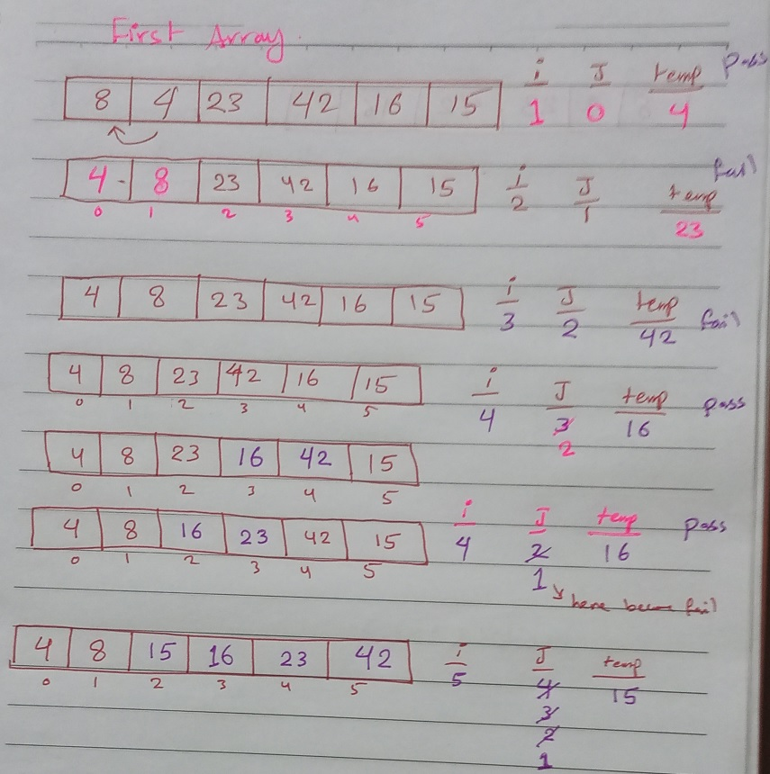
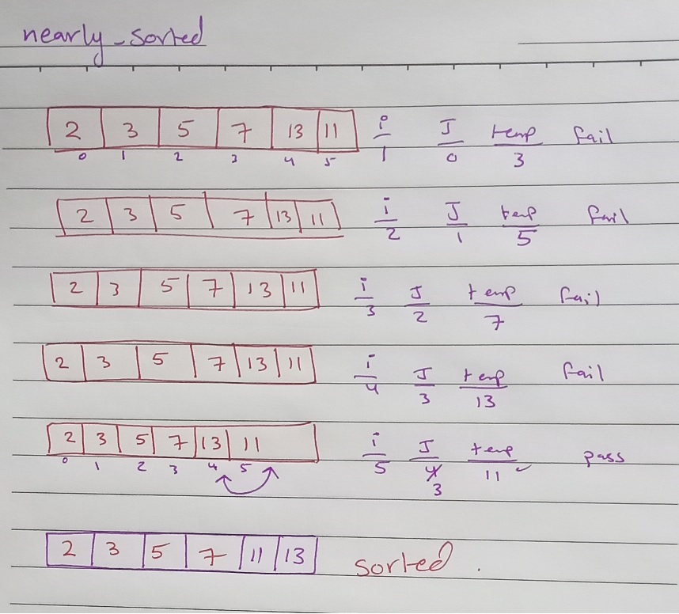
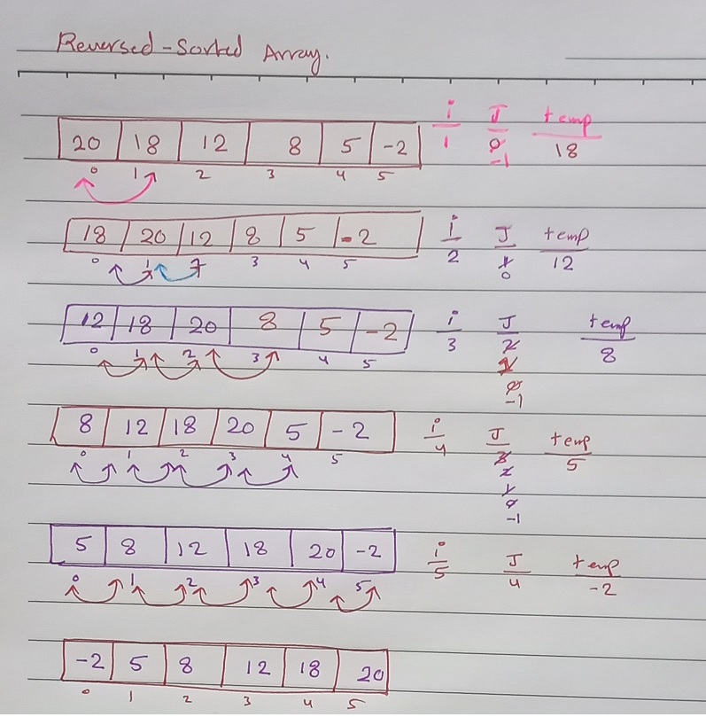
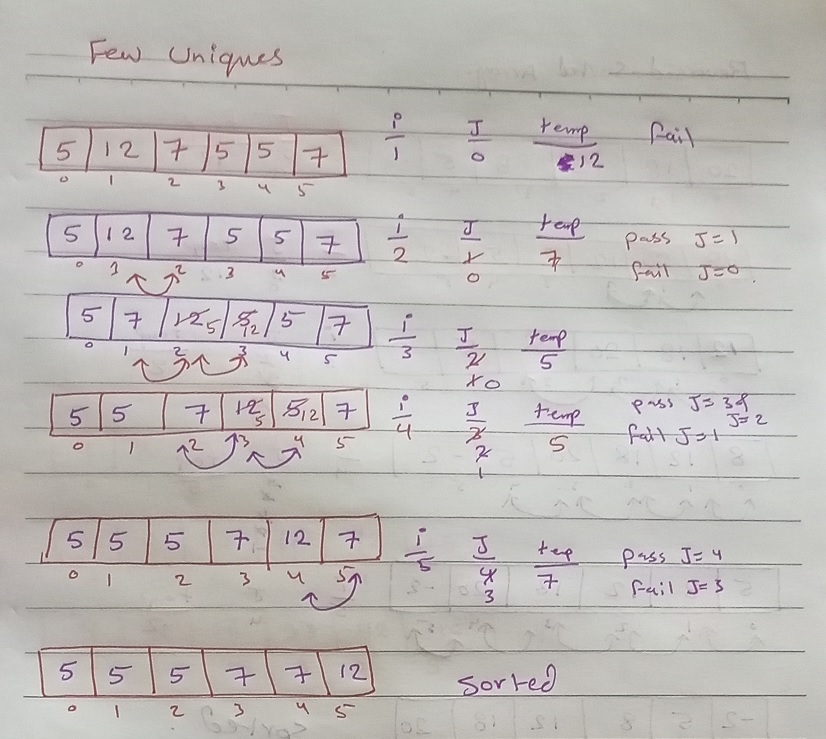

# Insertion Sort
* a method insertionSort takes an array as a parameter and return the array sorted

## Java Code 
>public static int[] insertionSort(int[] arr){
> 
>for (int i = 1; i < arr.length; i++) {
> 
>int j = i-1;
> 
>int temp = arr[i];
>
>           while (j>=0 && temp< arr[j])
> 
>           {
> 
>              arr[j+1] = arr[j];
> 
>              j = j-1;
> 
>          }
> 
>          arr[j+1] = temp;
> 
>      }
> 
>      return arr;
> 
> }
>
> 

## Tracing

