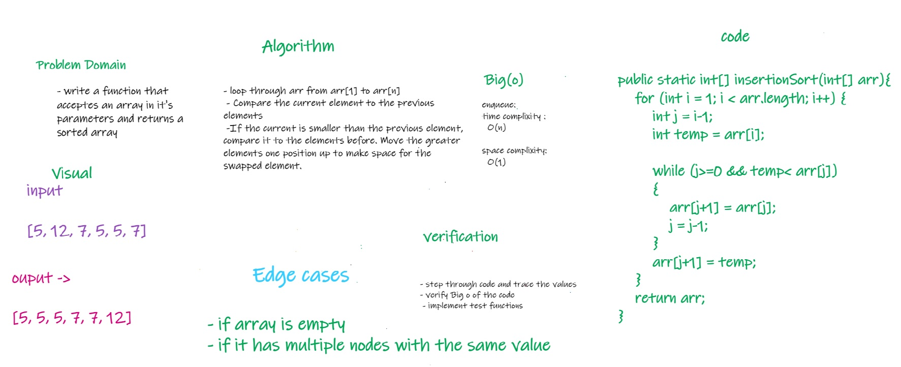

# Challenge Summary
<!-- Description of the challenge -->
a method insertionSort takes an array as a parameter and return the array sorted

## Whiteboard Process
<!-- Embedded whiteboard image -->

## Approach & Efficiency
<!-- What approach did you take? Why? What is the Big O space/time for this approach? -->
    *  loop through arr from arr[1] to arr[n]
    * Compare the current element to the previous elements
    * If the current is smaller than the previous element, compare it to the elements before. Move the greater elements one position up to make space for the swapped element.

    * time complixity : O(n)
    * space complixity : O(1)

## Solution
<!-- Show how to run your code, and examples of it in action -->
    * call function isertionSort(), pass an array into it's parameters, a sorted array will return 
    * example :
        * isertionSort({20,18,12,8,5,-2})
        * result will be  : [-2, 5, 8, 12, 18, 20]

[Link To Code](../code26/app/src/main/java/code26/App.java)

[Link To BLOG file](../code26/BLOG.md)
