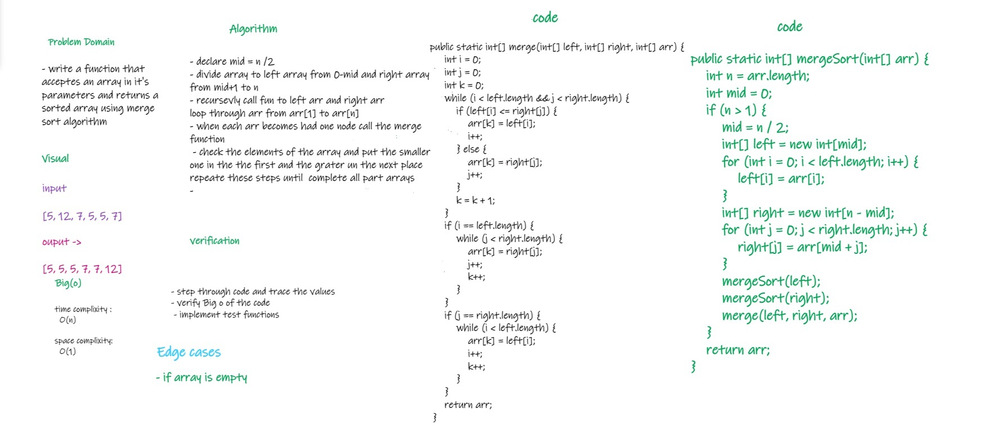

# Challenge Summary
<!-- Description of the challenge -->
* declare a function that recives an array in its parameters and returns the array in sorted way using merge sort algorithm
## Whiteboard Process
<!-- Embedded whiteboard image -->

## Approach & Efficiency
<!-- What approach did you take? Why? What is the Big O space/time for this approach? -->
- declare mid = n /2
- divide array to left array from 0-mid and right array from mid+1 to n
- recursevly call fun to left arr and right arr
  loop through arr from arr[1] to arr[n]
- when each arr becomes had one node call the merge function
- check the elements of the array and put the smaller one in the the first and the grater un the next place
  repeate these steps until  complete all part arrays

* time complixity : O(n)
* space complixity : O(1)

## Solution
<!-- Show how to run your code, and examples of it in action -->
* call function mergeSort and pass array you want to sort in the parameters 
  * example : 
    * mergeSort(new int[]{5,12,7,5,5,7})

[Link to code](./app/src/main/java/code27/App.java)

[Link to BLOG file](./BLOG.md)