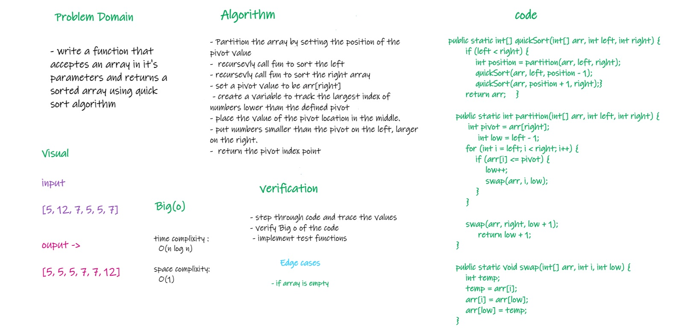

# Challenge Summary
<!-- Description of the challenge -->
* declare a function that receives an array in its parameters and returns the array in sorted way using quick sort algorithm
## Whiteboard Process
<!-- Embedded whiteboard image -->

## Approach & Efficiency
<!-- What approach did you take? Why? What is the Big O space/time for this approach? -->
- Partition the array by setting the position of the pivot value
-  recursevly call fun to sort the left
- recursevly call fun to sort the right array
- set a pivot value to be arr[right]
- create a variable to track the largest index of numbers lower than the defined pivot
- place the value of the pivot location in the middle.
- put numbers smaller than the pivot on the left, larger on the right.
-  return the pivot index point

* time complixity : O(n log n)
* space complixity : O(1)

## Solution
<!-- Show how to run your code, and examples of it in action -->
* call function quickSort and pass array you want to sort in the parameters
    * example :
        * quickSort(new int[]{5,12,7,5,5,7})

[Link to code](./app/src/main/java/code28/App.java)

[Link to BLOG file](./BLOG.md)