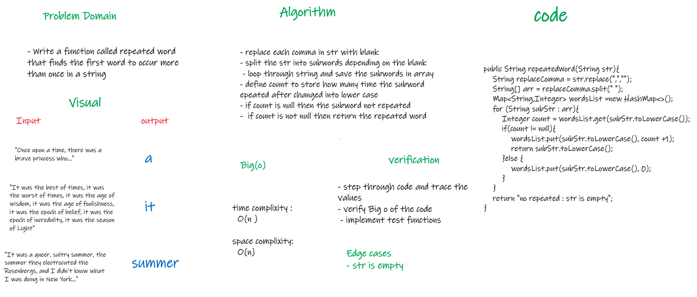

# Challenge Summary
<!-- Description of the challenge -->
* Write a function called repeated word that finds the first word to occur more than once in a string

## Whiteboard Process
<!-- Embedded whiteboard image -->

## Approach & Efficiency
<!-- What approach did you take? Why? What is the Big O space/time for this approach? -->
- replace each comma in str with blank
- split the str into subwords depending on the blank
- loop through string and save the subwords in array
- define count to store how many time the subword epeated after changed into lower case
- if count is null then the subword not repeated
- if count is not null then return the repeated word

* time complixity :
O(n )

space complixity:
O(n)

## Solution
<!-- Show how to run your code, and examples of it in action -->
call the function repeatedWord and pass a string in the parameters
 ex : repeatedWord("Once upon a time, there was a brave princess who...")

[Link to code](app/src/main/java/code30/HashTable.java)