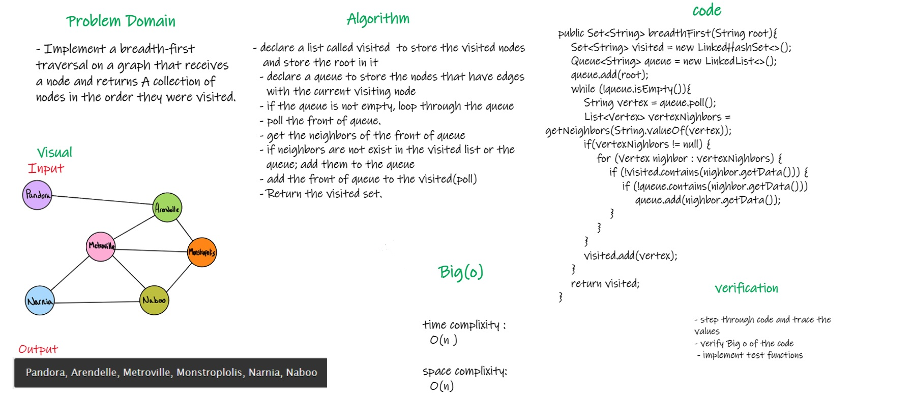

# Challenge Summary
<!-- Description of the challenge -->

Implement a breadth-first traversal on a graph that receives a node and returns A collection of nodes in the order they were visited.

## Whiteboard Process
<!-- Embedded whiteboard image -->
 

## Approach & Efficiency
<!-- What approach did you take? Why? What is the Big O space/time for this approach? -->
   * declare a list called visited  to store the visited nodes and store the root in it
   * declare a queue to store the nodes that have edges with the current visiting node
   * if the queue is not empty, loop through the queue
   * poll the front of queue.
   * get the neighbors of the front of queue
   * if neighbors are not exist in the visited list or the queue; add them to the queue
   * add the front of queue to the visited(poll)
   * Return the visited set.

   * Time Complixity: O(n)
   * space Complixity: O(n)

## Solution
<!-- Show how to run your code, and examples of it in action -->
   * call the breadthFirst and send the root of graph in the parameters
     * example: breadthFirst("A")

   [Link To Code ](app/src/main/java/code36/Graph.java)