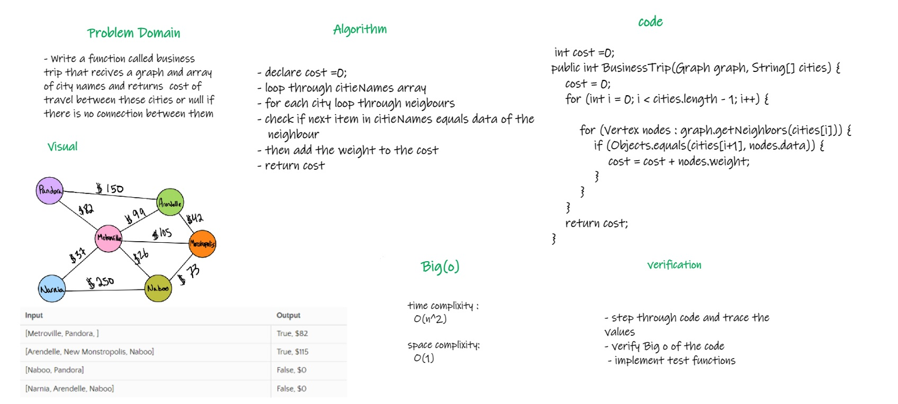

# Challenge Summary
<!-- Description of the challenge -->
  - Write a function called business trip that recives a graph and array of city names 
  - and returns  cost of travel between these cities or null if there is no connection between them

## Whiteboard Process
<!-- Embedded whiteboard image -->

## Approach & Efficiency
<!-- What approach did you take? Why? What is the Big O space/time for this approach? -->
  - declare cost =0;
  - loop through citieNames array
  - for each city loop through neigbours
  - check if next item in citieNames equals data of the neighbour
  - then add the weight to the cost 
  - return cost

  - Time Complixity : O(n^2)
  - space Complixity : O(1)

## Solution
<!-- Show how to run your code, and examples of it in action -->
   - call function businessTrip() and send in the parameters the graph and an array of cities
     - example: businessTrip(graph, arr)

   - [Link To code](app/src/main/java/code37/Graph.java)
