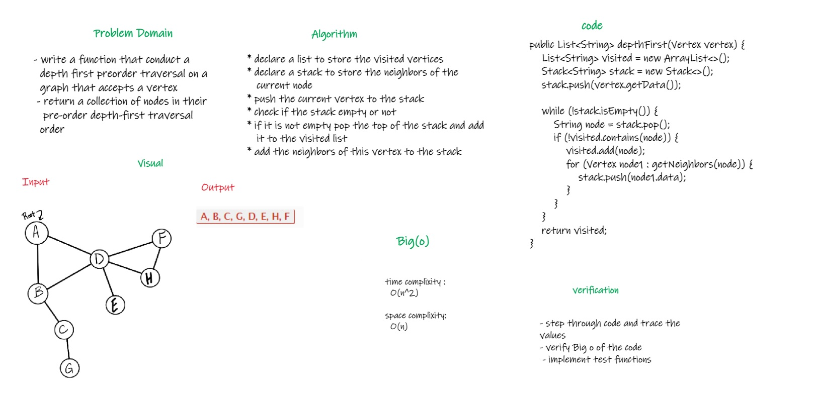

# Depth First Traversal
<!-- Short summary or background information -->
   * an algorithm for traversing or searching tree or graph data structures. 
   * The algorithm starts at the root node (selecting some arbitrary node as the root node in the case of a graph) 
   * and explores as far as possible along each branch before backtracking.

## Challenge
<!-- Description of the challenge -->
   * write a function that conduct a depth first preorder traversal on a graph that accepts a vertex 
   * return a collection of nodes in their pre-order depth-first traversal order

   

## Approach & Efficiency
<!-- What approach did you take? Why? What is the Big O space/time for this approach? -->
   * declare a list to store the visited vertices
   * declare a stack to store the neighbors of the current node
   * push the current vertex to the stack
   * check if the stack empty or not
   * if it is not empty pop the top of the stack and add it to the visited list
   * add the neighbors of this vertex to the stack

## Solution
<!-- Embedded whiteboard image -->
  
  
  [Link To Code](app/src/main/java/code38/Graph.java)