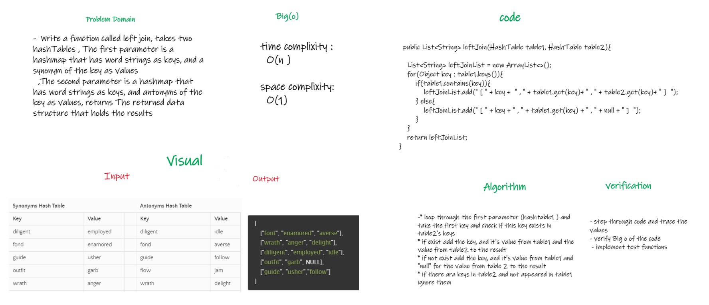

# Hashmap LEFT JOIN
<!-- Short summary or background information -->
* what is left join for two hashtables ?
* add all keys to an array list , with there values from table1, and add there values from table2 if exixt, if not exist add "null"
* if there are keys in table2 not in table1 they are not added

## Challenge
<!-- Description of the challenge -->
* Write a function called left join, takes two hashTables , The first parameter is a hashmap that has word strings as keys, and a synonym of the key as values
  ,The second parameter is a hashmap that has word strings as keys, and antonyms of the key as values, returns The returned data structure that holds the results

## Approach & Efficiency
<!-- What approach did you take? Why? What is the Big O space/time for this approach? -->
* loop through the first parameter (hashtable1 ) and take the first key and check if this key exists in table2's keys
* if exist add the key, and it's value from table1 and the value from table2 to the result
* if not exist add the key, and it's value from table1 and "null" for the value from table 2 to the result 
* if there ara keys in table2 and not appeared in table1 ignore them

## Solution
<!-- Embedded whiteboard image -->

[Link to code](app/src/main/java/leftjoin/LeftJoin.java)
