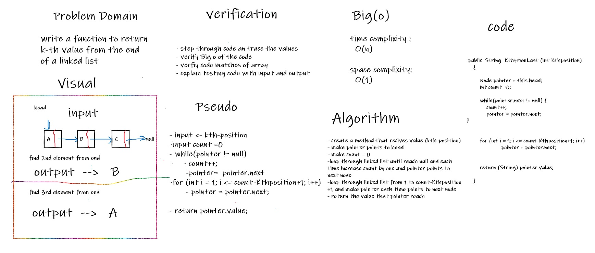

# Challenge Summary
<!-- Description of the challenge -->

* Write the following method for the Linked List class that recivecs an integer and return the value of node that represent Kth node from the end

## Whiteboard Process
<!-- Embedded whiteboard image -->
white board for function KthPositionFromEnd 

## Approach & Efficiency
<!-- What approach did you take? Why? What is the Big O space/time for this approach? -->

* the approach I take is to loop through array until find the number of nodes then loop to until reach count-kthposition  and return this node value 

 * Time complixit : Big(O)
 * space complixity: O(1)

## Solution
<!-- Show how to run your code, and examples of it in action -->

* Kthposition : 
    *  if you want to return value of node linked list that in kth position from the end call KthFromLast and pass the k number  
     * example : KthFromLast(3);

  
    * link To code  [Link](/linkedList/app/src/main/java/linkedList/linkedList1.java)

