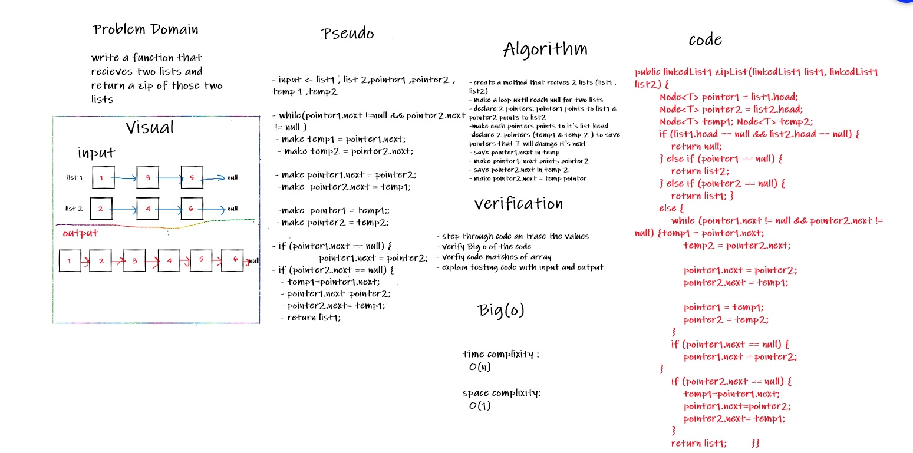

# Challenge Summary
<!-- Description of the challenge -->

* Write the following method for the Linked List class that recivecs an integer and return the value of node that represent Kth node from the end

## Whiteboard Process
<!-- Embedded whiteboard image -->
white board for function KthPositionFromEnd

## Approach & Efficiency
<!-- What approach did you take? Why? What is the Big O space/time for this approach? -->

* the approach I take is to loop through array until reach node.next == null each time make node from list points to node from list 2 as it's next 
* and return linked list consists of the two lists

* Time complixit : Big(O)
* space complixity: O(1)

## Solution
<!-- Show how to run your code, and examples of it in action -->

* zipList: function takes 2 lists in it's parameters and return one list zipped together each node from first list then node from the second one
    * example: ziplist(list1, list2)

    * link To code  [Link](/linkedList/app/src/main/java/linkedList/linkedList1.java)
