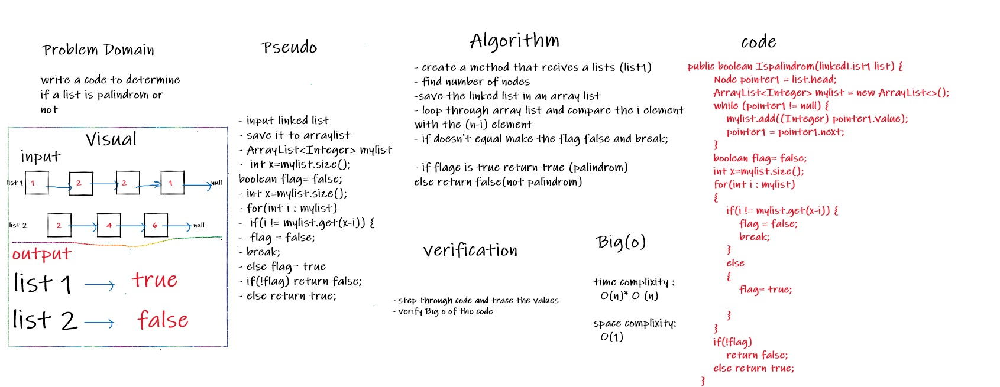

# Challenge Summary
<!-- Description of the challenge -->

* Write the method to Linked List class that recivecs a lists and return the if it is palindrom or not

## Whiteboard Process
<!-- Embedded whiteboard image -->

white board for function isPalindrom

## Approach & Efficiency
<!-- What approach did you take? Why? What is the Big O space/time for this approach? -->

* the approach I take is to save the linked list into array and loop through array until reach the last element, each time compare element i with element n-i
* if they are equal return true else return false

* Time complixit : O(n)*O(n)
* space complixity: O(n)

## Solution
<!-- Show how to run your code, and examples of it in action -->

* isPalindrom: function takes a lists in it's parameters and return if it is palindrom or not
    * example: isPalindrom(list)

    * link To code  [Link](/linkedList/app/src/main/java/linkedList/linkedList1.java)
