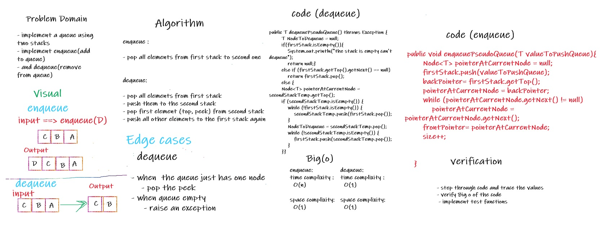

# Challenge Summary
<!-- Description of the challenge -->

* implement a queue using 2 stacks
* implement an enqueue methode : to add new node to the front of queue
* implement dequeue methode : to pop (remove) node from the front of the queue 

## Whiteboard Process
<!-- Embedded whiteboard image -->

## Approach & Efficiency
<!-- What approach did you take? Why? What is the Big O space/time for this approach? -->

## Solution
<!-- Show how to run your code, and examples of it in action -->

* to add new node to the queue :
  * call method : enqueue() , and pass a new node as parameter 
  * example : enqueue(node);

* to remove (dequeue) node from front of queue:
  * call method : dequeue() , it removes the top node 
  * example : enqueue();

* link to code : [Link](./app/src/main/java/stackAndQueue/PseudoQueue.java)
