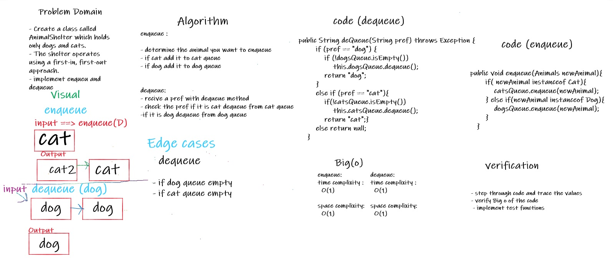

# Challenge Summary
<!-- Description of the challenge -->

* implement an animal shelter class 
* contains just Dogs and Cats 
* implement an enqueue methode 
*  implement a dequeue method

## Whiteboard Process
<!-- Embedded whiteboard image -->

## Approach & Efficiency
<!-- What approach did you take? Why? What is the Big O space/time for this approach? -->

## Solution
<!-- Show how to run your code, and examples of it in action -->

* to add new animal to the queue :
    * call method : enqueue() , and pass a new animal as parameter
    * if it is cat it will added to catsQueue
    * if it is dog it will added to dogsQueue
    * example : enqueue("cat");

* to dequeue animal (dequeue) animal from front of queue:
    * call method : dequeue() , it removes the top animal of its type queue 
    * if you want to dequeue a cat : 
      * example : enqueue("cat);

* link to code : [Link](./app/src/main/java/stackAndQueue/AnimalShelter.java)
