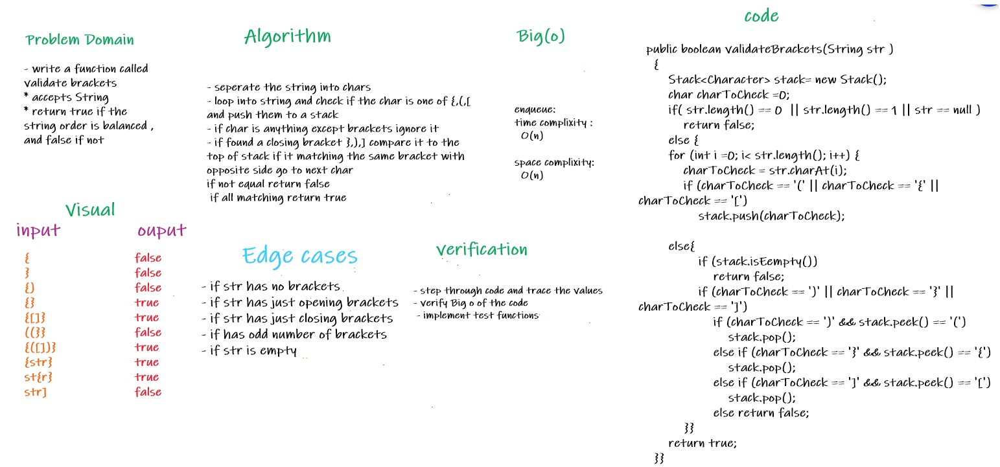

# Challenge Summary
<!-- Description of the challenge -->

* implement a method that takes a String as parameters 
* check if the string has a brackets in balanced order, if in balanced order return true 
* else return false 

## Whiteboard Process
<!-- Embedded whiteboard image -->

## Approach & Efficiency
<!-- What approach did you take? Why? What is the Big O space/time for this approach? -->
* when receive a string separate it to characters and check each char if is it one of opening brackets (,{,[ then push it to stack
* if it is one of closing brackets ),},] then copmpare it to the peek of stack  if equals got to next char else return zero 
* ignore any char that is not a bracket 
* if remaining brackets matching with brackets in stack but in opposite direction return true 

* Time complixity : O(n)
* space complixity : O(n)

## Solution
<!-- Show how to run your code, and examples of it in action -->

 * to run the code :
   * declare an instance from ValidateBrackets class 
   * use the instance to call method validateBrackets and pass a string as Parameters
   * example : 
     * validateBrackets ("({){}]") 
     * it will return false in this case

* link to code : [Link](./app/src/main/java/stackAndQueue/ValidateBrackets.java)
