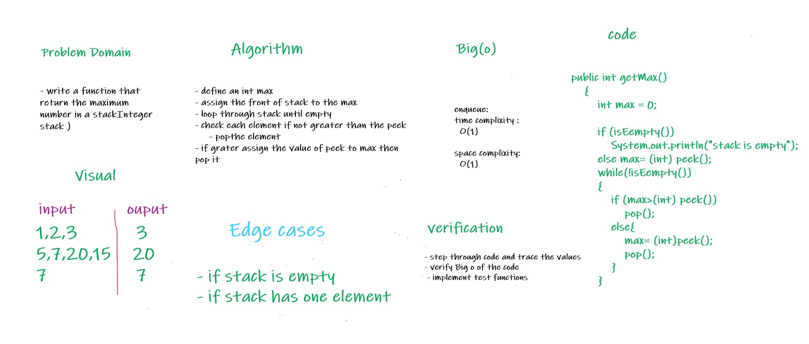

# Challenge Summary
<!-- Description of the challenge -->

* implement a method that returns the maximum number in the stack

## Whiteboard Process
<!-- Embedded whiteboard image -->

## Approach & Efficiency
<!-- What approach did you take? Why? What is the Big O space/time for this approach? -->

* define an integer obj from stack class
* enqueue integer numbers to stack
* call method getMax to return the maximum number

* Time complexity : O(1)
* space complexity : O(1)

## Solution
<!-- Show how to run your code, and examples of it in action -->

* to run the code :
    * declare an instance from stack class
    * use the instance to call method getMax
    * example :
        * getMax ()
        * it will return maximum number in stack if not empty, and if stack empty it will return 0

* link to code : [Link](./app/src/main/java/stackAndQueue/Stack.java)