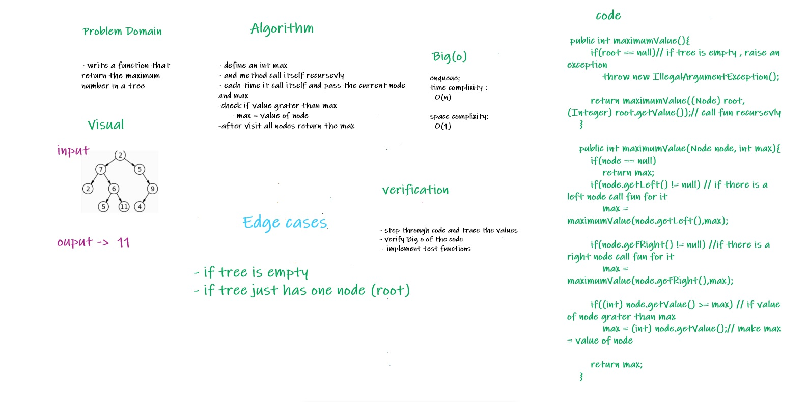

# Challenge Summary
<!-- Description of the challenge -->

* Find the Maximum Value in a Binary Tree
* find maximum value
  Arguments: none
  Returns: number

## Whiteboard Process
<!-- Embedded whiteboard image -->

## Approach & Efficiency
<!-- What approach did you take? Why? What is the Big O space/time for this approach? -->
* declare an int value called max 
* compare the nax with root.value if > max make max =value of root and call maximum and pass the max and next node 
* recursivly call the method until the tree nodes all compared
* in this approach no need to loop the recursive fun calls itself each time 
* Time complixity : O(n)
* space complixity : O(1)

## Solution
<!-- Show how to run your code, and examples of it in action -->
* to run the code : 
    * declare an object from binaryTree class 
    * add values to the tree (instantiate the tree)
    * call fun maximumValue()

* link to code : [Link](./app/src/main/java/trees/BinaryTree.java)
