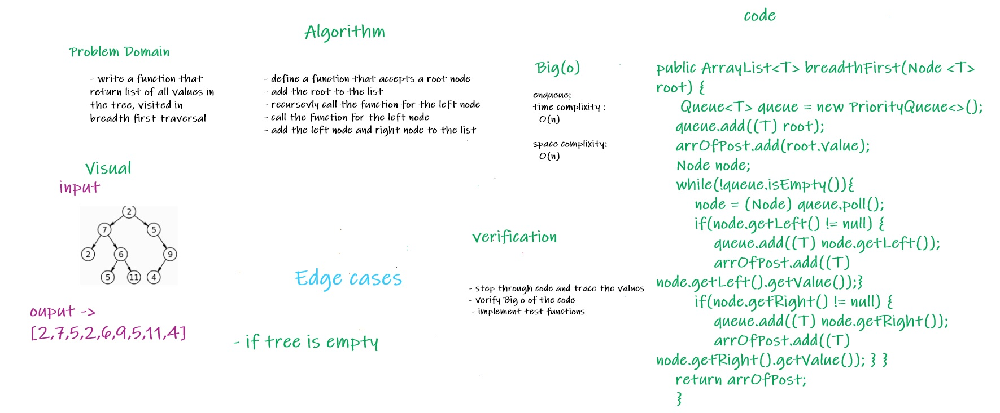

# Challenge Summary
<!-- Description of the challenge -->

* Write a function called breadth first
* Arguments: tree
* Return: list of all values in the tree, in the order they were encountered

## Whiteboard Process
<!-- Embedded whiteboard image -->

## Approach & Efficiency
<!-- What approach did you take? Why? What is the Big O space/time for this approach? -->
* declare a new queue from java's built-in queue and use it to save the node left and right of node uou visit
* at first add the root then add irs left then it's right 
* then each node you visit add to list 
* Time complixity : O(n)
* space complixity : O(n)

## Solution
<!-- Show how to run your code, and examples of it in action -->
* to run the code :
    * creat an object Queue<T> queue = new PriorityQueue<>();// Create new object
    * add root to the queue then the left of root then the right and repeat until finish the tree
    * call fun breadthFirst(), pass the root of tree as parameter

* link to code : [Link](./app/src/main/java/trees/BinaryTree.java)
