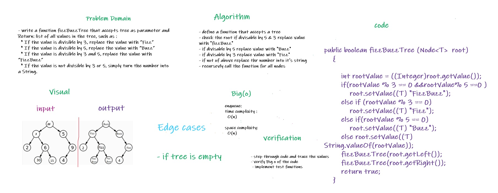

# Challenge Summary
<!-- Description of the challenge -->

* Write a function called fizzBuzzTree 
* Arguments: tree
* Return: list of all values in the tree, such as :
  * If the value is divisible by 3, replace the value with “Fizz”
  * If the value is divisible by 5, replace the value with “Buzz”
  * If the value is divisible by 3 and 5, replace the value with “FizzBuzz”
  * If the value is not divisible by 3 or 5, simply turn the number into a String.

## Whiteboard Process
<!-- Embedded whiteboard image -->

## Approach & Efficiency
<!-- What approach did you take? Why? What is the Big O space/time for this approach? -->
* declare a function accepts a tree and recursevly call itself 
* check if value is divisible by 3, replace the value with “Fizz”
* check if value is divisible by 5, replace the value with “Buzz”
* check if value is divisible by 3 and 5, replace the value with “FizzBuzz”
* check if value divisible by 3 or 5, simply turn the number into a String.
* Time complixity : O(n)
* space complixity : O(1)

## Solution
<!-- Show how to run your code, and examples of it in action -->
* to run the code :
   
    * call fun fizzBuzzTree(), pass the tree as parameter

* link to code : [Link](./app/src/main/java/trees/BinaryTree.java)
