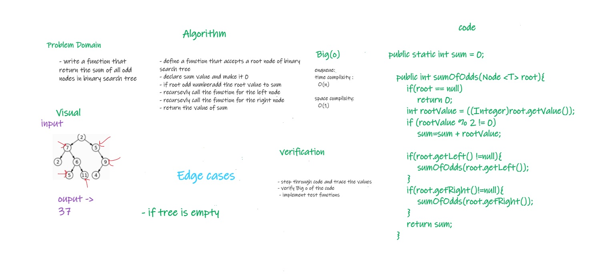

# Challenge Summary
<!-- Description of the challenge -->

* Write a function called sumOfOdds
* Arguments: tree root
* Return: sum of odd nodes in binary search tree

## Whiteboard Process
<!-- Embedded whiteboard image -->

## Approach & Efficiency
<!-- What approach did you take? Why? What is the Big O space/time for this approach? -->
* declare a function called sumOfOdds recieves root of binary search tree
* check if root is odd add the value to sum 
* call the function for left node if exist
* call the function for right node if exist
* Time complixity : O(n)
* space complixity : O(1)

## Solution
<!-- Show how to run your code, and examples of it in action -->
* to run the code :
  * call fun sumOfOdds(), pass the root of tree as parameter

* link to code : [Link](./app/src/main/java/trees/BinarySearchTree.java)
